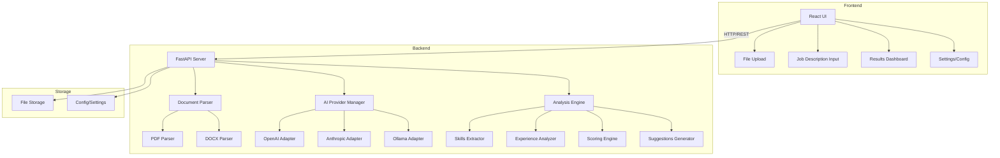

# AI Resume Analyzer - Implementation Plan

## 🎯 Project Overview

An AI-powered resume analyzer that parses resumes (PDF/DOCX), extracts key information, scores against job descriptions, and provides improvement suggestions with support for multiple AI providers.

## Architecture



## Key Features

### 1. Document Processing
- PDF and DOCX resume parsing
- Text extraction with formatting preservation
- Metadata extraction (contact info, dates, etc.)

### 2. AI Analysis (Multi-Provider)
- OpenAI GPT-4/3.5 integration
- Anthropic Claude integration
- Local LLM support via Ollama
- Configurable provider selection

### 3. Resume Analysis
- Skills extraction and categorization
- Experience level assessment
- Education verification
- ATS compatibility scoring
- Job description matching

### 4. Scoring System
- Overall resume score (0-100)
- Category-specific scores (skills, experience, format)
- Job match percentage
- ATS compatibility rating

### 5. Improvement Suggestions
- Missing keywords identification
- Format recommendations
- Content enhancement tips
- Skill gap analysis

## Technology Stack

### Backend
- **Python 3.11+**
- **FastAPI** - REST API framework
- **PyPDF2 / pdfplumber** - PDF parsing
- **python-docx** - DOCX parsing
- **OpenAI SDK** - OpenAI integration
- **Anthropic SDK** - Claude integration
- **LangChain** - Optional LLM orchestration
- **Pydantic** - Data validation

### Frontend
- **React 18+ with TypeScript**
- **Vite** - Build tool
- **TailwindCSS** - Styling
- **React Query** - API state management
- **React Dropzone** - File uploads
- **Recharts** - Data visualization

### DevOps
- Docker & Docker Compose
- Environment-based configuration
- CORS handling
- API documentation (FastAPI auto-docs)

## Project Structure

```
ai-resume-analyzer/
├── backend/
│   ├── app/
│   │   ├── __init__.py
│   │   ├── main.py
│   │   ├── config.py
│   │   ├── api/
│   │   │   ├── __init__.py
│   │   │   ├── routes/
│   │   │   │   ├── analyze.py
│   │   │   │   ├── upload.py
│   │   │   │   └── health.py
│   │   ├── core/
│   │   │   ├── parsers/
│   │   │   │   ├── pdf_parser.py
│   │   │   │   └── docx_parser.py
│   │   │   ├── ai_providers/
│   │   │   │   ├── base.py
│   │   │   │   ├── openai_provider.py
│   │   │   │   ├── anthropic_provider.py
│   │   │   │   └── ollama_provider.py
│   │   │   ├── analyzer/
│   │   │   │   ├── skills_extractor.py
│   │   │   │   ├── experience_analyzer.py
│   │   │   │   ├── scoring_engine.py
│   │   │   │   └── suggestions_generator.py
│   │   ├── models/
│   │   │   ├── resume.py
│   │   │   ├── analysis.py
│   │   │   └── job_description.py
│   │   └── utils/
│   │       ├── text_processing.py
│   │       └── validators.py
│   ├── tests/
│   ├── requirements.txt
│   └── Dockerfile
├── frontend/
│   ├── src/
│   │   ├── components/
│   │   │   ├── FileUpload.tsx
│   │   │   ├── JobDescriptionInput.tsx
│   │   │   ├── AnalysisResults.tsx
│   │   │   ├── ScoreCard.tsx
│   │   │   └── Settings.tsx
│   │   ├── services/
│   │   │   └── api.ts
│   │   ├── types/
│   │   │   └── index.ts
│   │   ├── App.tsx
│   │   └── main.tsx
│   ├── package.json
│   └── Dockerfile
├── docker-compose.yml
├── .env.example
└── README.md
```

## API Endpoints

```
POST   /api/v1/upload          - Upload resume file
POST   /api/v1/analyze         - Analyze resume
POST   /api/v1/compare         - Compare resume with job description
GET    /api/v1/providers       - List available AI providers
POST   /api/v1/config          - Update configuration
GET    /api/v1/health          - Health check
```

## Implementation Phases

### Phase 1: Core Infrastructure (Tasks 1-4)
- Project setup and structure
- Backend environment configuration
- Document parsing implementation
- Text processing utilities

### Phase 2: AI Integration (Tasks 5-8)
- AI provider abstraction layer
- Multiple provider adapters
- Provider configuration management

### Phase 3: Analysis Engine (Tasks 9-12)
- Resume analysis algorithms
- Job matching logic
- Scoring system
- Suggestions generation

### Phase 4: API Layer (Task 13)
- REST API endpoints
- Request/response models
- Error handling

### Phase 5: Frontend Development (Tasks 14-20)
- React application setup
- UI components
- API integration
- Provider selection interface

### Phase 6: Configuration & Polish (Tasks 21-24)
- Environment management
- Error handling
- Documentation
- User guides

### Phase 7: Testing & Deployment (Tasks 25-28)
- Unit and integration tests
- Docker containerization
- Deployment setup

## Configuration Example

```env
# Backend
BACKEND_PORT=8000
FRONTEND_PORT=3000

# AI Providers
OPENAI_API_KEY=your_key_here
ANTHROPIC_API_KEY=your_key_here
OLLAMA_BASE_URL=http://localhost:11434

# Default Provider
DEFAULT_AI_PROVIDER=openai

# File Upload
MAX_FILE_SIZE_MB=10
ALLOWED_EXTENSIONS=pdf,docx

# Analysis Settings
ENABLE_ATS_CHECK=true
ENABLE_SKILL_MATCHING=true
```

## Next Steps

This plan provides a complete roadmap for building the AI Resume Analyzer with:
- ✅ Multi-format resume parsing (PDF, DOCX)
- ✅ Multiple AI provider support (OpenAI, Anthropic, Ollama)
- ✅ Comprehensive analysis and scoring
- ✅ Job description matching
- ✅ Improvement suggestions
- ✅ Modern, responsive UI
- ✅ Docker deployment ready

Ready to proceed with implementation!